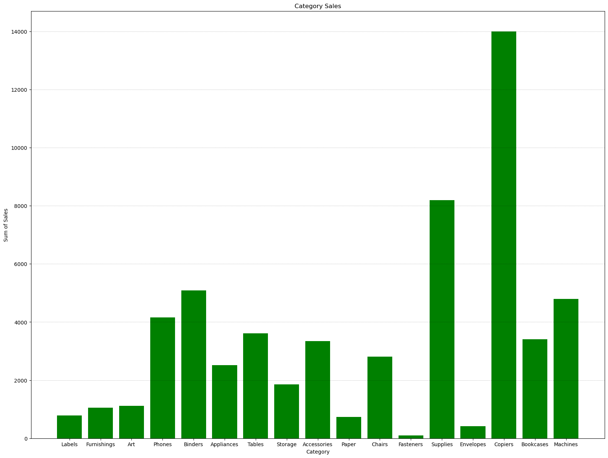
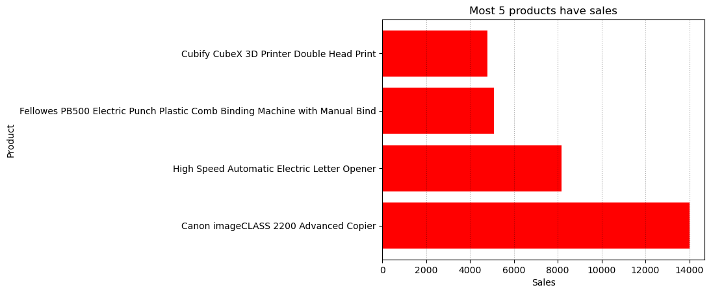
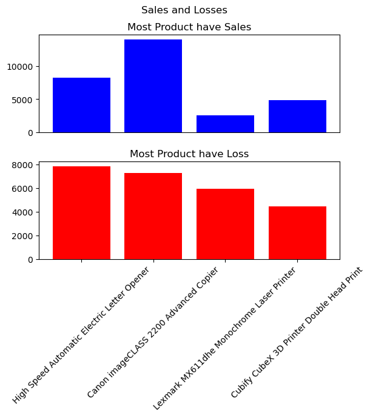
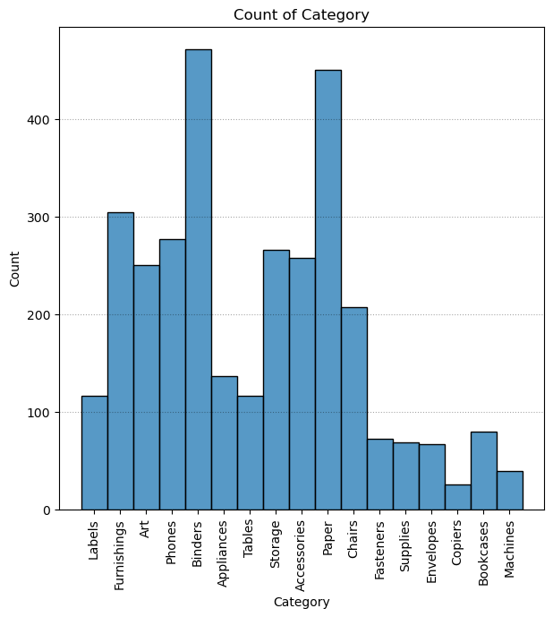

# Importing Libraries


```python
import numpy as np
import pandas as pd
import matplotlib.pyplot as plt
import seaborn as sns
```


```python
data = pd.read_csv("Amazon_Raw.csv")
```


```python
data
```


<div>
<style scoped>
    .dataframe tbody tr th:only-of-type {
        vertical-align: middle;
    }

    .dataframe tbody tr th {
        vertical-align: top;
    }

    .dataframe thead th {
        text-align: right;
    }
</style>
<table border="1" class="dataframe">
  <thead>
    <tr style="text-align: right;">
      <th></th>
      <th>Order ID</th>
      <th>Order Date</th>
      <th>Ship Date</th>
      <th>EmailID</th>
      <th>Geography</th>
      <th>Category</th>
      <th>Product Name</th>
      <th>Sales</th>
      <th>Quantity</th>
      <th>Profit</th>
    </tr>
  </thead>
  <tbody>
    <tr>
      <th>0</th>
      <td>CA-2013-138688</td>
      <td>13/06/2013</td>
      <td>17/06/2013</td>
      <td>DarrinVanHuff@gmail.com</td>
      <td>United States,Los Angeles,California</td>
      <td>Labels</td>
      <td>Self-Adhesive Address Labels for Typewriters b...</td>
      <td>14.62</td>
      <td>2.0</td>
      <td>6.87</td>
    </tr>
    <tr>
      <th>1</th>
      <td>CA-2011-115812</td>
      <td>09/06/2011</td>
      <td>14/06/2011</td>
      <td>BrosinaHoffman@gmail.com</td>
      <td>United States,Los Angeles,California</td>
      <td>Furnishings</td>
      <td>Eldon Expressions Wood and Plastic Desk Access...</td>
      <td>48.86</td>
      <td>7.0</td>
      <td>14.17</td>
    </tr>
    <tr>
      <th>2</th>
      <td>CA-2011-115812</td>
      <td>09/06/2011</td>
      <td>14/06/2011</td>
      <td>BrosinaHoffman@gmail.com</td>
      <td>United States,Los Angeles,California</td>
      <td>Art</td>
      <td>Newell 322</td>
      <td>7.28</td>
      <td>4.0</td>
      <td>1.97</td>
    </tr>
    <tr>
      <th>3</th>
      <td>CA-2011-115812</td>
      <td>09/06/2011</td>
      <td>14/06/2011</td>
      <td>BrosinaHoffman@gmail.com</td>
      <td>United States,Los Angeles,California</td>
      <td>Phones</td>
      <td>Mitel 5320 IP Phone VoIP phone</td>
      <td>907.15</td>
      <td>4.0</td>
      <td>90.72</td>
    </tr>
    <tr>
      <th>4</th>
      <td>CA-2011-115812</td>
      <td>09/06/2011</td>
      <td>14/06/2011</td>
      <td>BrosinaHoffman@gmail.com</td>
      <td>United States,Los Angeles,California</td>
      <td>Binders</td>
      <td>DXL Angle-View Binders with Locking Rings by S...</td>
      <td>18.50</td>
      <td>3.0</td>
      <td>5.78</td>
    </tr>
    <tr>
      <th>...</th>
      <td>...</td>
      <td>...</td>
      <td>...</td>
      <td>...</td>
      <td>...</td>
      <td>...</td>
      <td>...</td>
      <td>...</td>
      <td>...</td>
      <td>...</td>
    </tr>
    <tr>
      <th>3198</th>
      <td>CA-2013-125794</td>
      <td>30/09/2013</td>
      <td>04/10/2013</td>
      <td>MarisLaWare@gmail.com</td>
      <td>United States,Los Angeles,California</td>
      <td>Accessories</td>
      <td>Memorex Mini Travel Drive 64 GB USB 2.0 Flash ...</td>
      <td>36.24</td>
      <td>1.0</td>
      <td>15.22</td>
    </tr>
    <tr>
      <th>3199</th>
      <td>CA-2014-121258</td>
      <td>27/02/2014</td>
      <td>04/03/2014</td>
      <td>DaveBrooks@gmail.com</td>
      <td>United States,Costa Mesa,California</td>
      <td>Furnishings</td>
      <td>Tenex B1-RE Series Chair Mats for Low Pile Car...</td>
      <td>91.96</td>
      <td>2.0</td>
      <td>15.63</td>
    </tr>
    <tr>
      <th>3200</th>
      <td>CA-2014-121258</td>
      <td>27/02/2014</td>
      <td>04/03/2014</td>
      <td>DaveBrooks@gmail.com</td>
      <td>United States,Costa Mesa,California</td>
      <td>Phones</td>
      <td>Aastra 57i VoIP phone</td>
      <td>258.58</td>
      <td>2.0</td>
      <td>19.39</td>
    </tr>
    <tr>
      <th>3201</th>
      <td>CA-2014-121258</td>
      <td>27/02/2014</td>
      <td>04/03/2014</td>
      <td>DaveBrooks@gmail.com</td>
      <td>United States,Costa Mesa,California</td>
      <td>Paper</td>
      <td>It's Hot Message Books with Stickers, 2 3/4" x 5"</td>
      <td>29.60</td>
      <td>4.0</td>
      <td>13.32</td>
    </tr>
    <tr>
      <th>3202</th>
      <td>CA-2014-119914</td>
      <td>05/05/2014</td>
      <td>10/05/2014</td>
      <td>ChrisCortes@gmail.com</td>
      <td>United States,Westminster,California</td>
      <td>Appliances</td>
      <td>Acco 7-Outlet Masterpiece Power Center, Wihtou...</td>
      <td>243.16</td>
      <td>2.0</td>
      <td>72.95</td>
    </tr>
  </tbody>
</table>
<p>3203 rows × 10 columns</p>
</div>


```python
data=data.drop("Order ID" , axis=1)
```


```python
data = data.drop("EmailID" , axis=1)
```


```python
data
```


<div>
<style scoped>
    .dataframe tbody tr th:only-of-type {
        vertical-align: middle;
    }

    .dataframe tbody tr th {
        vertical-align: top;
    }

    .dataframe thead th {
        text-align: right;
    }
</style>
<table border="1" class="dataframe">
  <thead>
    <tr style="text-align: right;">
      <th></th>
      <th>Order Date</th>
      <th>Ship Date</th>
      <th>Geography</th>
      <th>Category</th>
      <th>Product Name</th>
      <th>Sales</th>
      <th>Quantity</th>
      <th>Profit</th>
    </tr>
  </thead>
  <tbody>
    <tr>
      <th>0</th>
      <td>13/06/2013</td>
      <td>17/06/2013</td>
      <td>United States,Los Angeles,California</td>
      <td>Labels</td>
      <td>Self-Adhesive Address Labels for Typewriters b...</td>
      <td>14.62</td>
      <td>2.0</td>
      <td>6.87</td>
    </tr>
    <tr>
      <th>1</th>
      <td>09/06/2011</td>
      <td>14/06/2011</td>
      <td>United States,Los Angeles,California</td>
      <td>Furnishings</td>
      <td>Eldon Expressions Wood and Plastic Desk Access...</td>
      <td>48.86</td>
      <td>7.0</td>
      <td>14.17</td>
    </tr>
    <tr>
      <th>2</th>
      <td>09/06/2011</td>
      <td>14/06/2011</td>
      <td>United States,Los Angeles,California</td>
      <td>Art</td>
      <td>Newell 322</td>
      <td>7.28</td>
      <td>4.0</td>
      <td>1.97</td>
    </tr>
    <tr>
      <th>3</th>
      <td>09/06/2011</td>
      <td>14/06/2011</td>
      <td>United States,Los Angeles,California</td>
      <td>Phones</td>
      <td>Mitel 5320 IP Phone VoIP phone</td>
      <td>907.15</td>
      <td>4.0</td>
      <td>90.72</td>
    </tr>
    <tr>
      <th>4</th>
      <td>09/06/2011</td>
      <td>14/06/2011</td>
      <td>United States,Los Angeles,California</td>
      <td>Binders</td>
      <td>DXL Angle-View Binders with Locking Rings by S...</td>
      <td>18.50</td>
      <td>3.0</td>
      <td>5.78</td>
    </tr>
    <tr>
      <th>...</th>
      <td>...</td>
      <td>...</td>
      <td>...</td>
      <td>...</td>
      <td>...</td>
      <td>...</td>
      <td>...</td>
      <td>...</td>
    </tr>
    <tr>
      <th>3198</th>
      <td>30/09/2013</td>
      <td>04/10/2013</td>
      <td>United States,Los Angeles,California</td>
      <td>Accessories</td>
      <td>Memorex Mini Travel Drive 64 GB USB 2.0 Flash ...</td>
      <td>36.24</td>
      <td>1.0</td>
      <td>15.22</td>
    </tr>
    <tr>
      <th>3199</th>
      <td>27/02/2014</td>
      <td>04/03/2014</td>
      <td>United States,Costa Mesa,California</td>
      <td>Furnishings</td>
      <td>Tenex B1-RE Series Chair Mats for Low Pile Car...</td>
      <td>91.96</td>
      <td>2.0</td>
      <td>15.63</td>
    </tr>
    <tr>
      <th>3200</th>
      <td>27/02/2014</td>
      <td>04/03/2014</td>
      <td>United States,Costa Mesa,California</td>
      <td>Phones</td>
      <td>Aastra 57i VoIP phone</td>
      <td>258.58</td>
      <td>2.0</td>
      <td>19.39</td>
    </tr>
    <tr>
      <th>3201</th>
      <td>27/02/2014</td>
      <td>04/03/2014</td>
      <td>United States,Costa Mesa,California</td>
      <td>Paper</td>
      <td>It's Hot Message Books with Stickers, 2 3/4" x 5"</td>
      <td>29.60</td>
      <td>4.0</td>
      <td>13.32</td>
    </tr>
    <tr>
      <th>3202</th>
      <td>05/05/2014</td>
      <td>10/05/2014</td>
      <td>United States,Westminster,California</td>
      <td>Appliances</td>
      <td>Acco 7-Outlet Masterpiece Power Center, Wihtou...</td>
      <td>243.16</td>
      <td>2.0</td>
      <td>72.95</td>
    </tr>
  </tbody>
</table>
<p>3203 rows × 8 columns</p>
</div>


```python
data["Loss"] = (data["Sales"])-data["Profit"]
```


```python
data
```


<div>
<style scoped>
    .dataframe tbody tr th:only-of-type {
        vertical-align: middle;
    }

    .dataframe tbody tr th {
        vertical-align: top;
    }

    .dataframe thead th {
        text-align: right;
    }
</style>
<table border="1" class="dataframe">
  <thead>
    <tr style="text-align: right;">
      <th></th>
      <th>Order Date</th>
      <th>Ship Date</th>
      <th>Geography</th>
      <th>Category</th>
      <th>Product Name</th>
      <th>Sales</th>
      <th>Quantity</th>
      <th>Profit</th>
      <th>Loss</th>
    </tr>
  </thead>
  <tbody>
    <tr>
      <th>0</th>
      <td>13/06/2013</td>
      <td>17/06/2013</td>
      <td>United States,Los Angeles,California</td>
      <td>Labels</td>
      <td>Self-Adhesive Address Labels for Typewriters b...</td>
      <td>14.62</td>
      <td>2.0</td>
      <td>6.87</td>
      <td>7.75</td>
    </tr>
    <tr>
      <th>1</th>
      <td>09/06/2011</td>
      <td>14/06/2011</td>
      <td>United States,Los Angeles,California</td>
      <td>Furnishings</td>
      <td>Eldon Expressions Wood and Plastic Desk Access...</td>
      <td>48.86</td>
      <td>7.0</td>
      <td>14.17</td>
      <td>34.69</td>
    </tr>
    <tr>
      <th>2</th>
      <td>09/06/2011</td>
      <td>14/06/2011</td>
      <td>United States,Los Angeles,California</td>
      <td>Art</td>
      <td>Newell 322</td>
      <td>7.28</td>
      <td>4.0</td>
      <td>1.97</td>
      <td>5.31</td>
    </tr>
    <tr>
      <th>3</th>
      <td>09/06/2011</td>
      <td>14/06/2011</td>
      <td>United States,Los Angeles,California</td>
      <td>Phones</td>
      <td>Mitel 5320 IP Phone VoIP phone</td>
      <td>907.15</td>
      <td>4.0</td>
      <td>90.72</td>
      <td>816.43</td>
    </tr>
    <tr>
      <th>4</th>
      <td>09/06/2011</td>
      <td>14/06/2011</td>
      <td>United States,Los Angeles,California</td>
      <td>Binders</td>
      <td>DXL Angle-View Binders with Locking Rings by S...</td>
      <td>18.50</td>
      <td>3.0</td>
      <td>5.78</td>
      <td>12.72</td>
    </tr>
    <tr>
      <th>...</th>
      <td>...</td>
      <td>...</td>
      <td>...</td>
      <td>...</td>
      <td>...</td>
      <td>...</td>
      <td>...</td>
      <td>...</td>
      <td>...</td>
    </tr>
    <tr>
      <th>3198</th>
      <td>30/09/2013</td>
      <td>04/10/2013</td>
      <td>United States,Los Angeles,California</td>
      <td>Accessories</td>
      <td>Memorex Mini Travel Drive 64 GB USB 2.0 Flash ...</td>
      <td>36.24</td>
      <td>1.0</td>
      <td>15.22</td>
      <td>21.02</td>
    </tr>
    <tr>
      <th>3199</th>
      <td>27/02/2014</td>
      <td>04/03/2014</td>
      <td>United States,Costa Mesa,California</td>
      <td>Furnishings</td>
      <td>Tenex B1-RE Series Chair Mats for Low Pile Car...</td>
      <td>91.96</td>
      <td>2.0</td>
      <td>15.63</td>
      <td>76.33</td>
    </tr>
    <tr>
      <th>3200</th>
      <td>27/02/2014</td>
      <td>04/03/2014</td>
      <td>United States,Costa Mesa,California</td>
      <td>Phones</td>
      <td>Aastra 57i VoIP phone</td>
      <td>258.58</td>
      <td>2.0</td>
      <td>19.39</td>
      <td>239.19</td>
    </tr>
    <tr>
      <th>3201</th>
      <td>27/02/2014</td>
      <td>04/03/2014</td>
      <td>United States,Costa Mesa,California</td>
      <td>Paper</td>
      <td>It's Hot Message Books with Stickers, 2 3/4" x 5"</td>
      <td>29.60</td>
      <td>4.0</td>
      <td>13.32</td>
      <td>16.28</td>
    </tr>
    <tr>
      <th>3202</th>
      <td>05/05/2014</td>
      <td>10/05/2014</td>
      <td>United States,Westminster,California</td>
      <td>Appliances</td>
      <td>Acco 7-Outlet Masterpiece Power Center, Wihtou...</td>
      <td>243.16</td>
      <td>2.0</td>
      <td>72.95</td>
      <td>170.21</td>
    </tr>
  </tbody>
</table>
<p>3203 rows × 9 columns</p>
</div>


```python
data.describe()
```


<div>
<style scoped>
    .dataframe tbody tr th:only-of-type {
        vertical-align: middle;
    }

    .dataframe tbody tr th {
        vertical-align: top;
    }

    .dataframe thead th {
        text-align: right;
    }
</style>
<table border="1" class="dataframe">
  <thead>
    <tr style="text-align: right;">
      <th></th>
      <th>Sales</th>
      <th>Quantity</th>
      <th>Profit</th>
      <th>Loss</th>
    </tr>
  </thead>
  <tbody>
    <tr>
      <th>count</th>
      <td>3203.000000</td>
      <td>3203.000000</td>
      <td>3203.000000</td>
      <td>3203.000000</td>
    </tr>
    <tr>
      <th>mean</th>
      <td>226.493266</td>
      <td>3.828910</td>
      <td>33.849138</td>
      <td>192.644127</td>
    </tr>
    <tr>
      <th>std</th>
      <td>524.876911</td>
      <td>2.260947</td>
      <td>174.109155</td>
      <td>432.977149</td>
    </tr>
    <tr>
      <th>min</th>
      <td>0.990000</td>
      <td>1.000000</td>
      <td>-3399.980000</td>
      <td>0.550000</td>
    </tr>
    <tr>
      <th>25%</th>
      <td>19.440000</td>
      <td>2.000000</td>
      <td>3.850000</td>
      <td>12.710000</td>
    </tr>
    <tr>
      <th>50%</th>
      <td>60.840000</td>
      <td>3.000000</td>
      <td>11.170000</td>
      <td>43.770000</td>
    </tr>
    <tr>
      <th>75%</th>
      <td>215.810000</td>
      <td>5.000000</td>
      <td>33.000000</td>
      <td>183.580000</td>
    </tr>
    <tr>
      <th>max</th>
      <td>13999.960000</td>
      <td>14.000000</td>
      <td>6719.980000</td>
      <td>7860.140000</td>
    </tr>
  </tbody>
</table>
</div>


```python
data.isna().sum()
```


    Order Date      0
    Ship Date       0
    Geography       0
    Category        0
    Product Name    0
    Sales           0
    Quantity        0
    Profit          0
    Loss            0
    dtype: int64


Don't Have Messing Values


```python
Sum_of_Sales = data["Sales"].sum()
```


```python
Sum_of_Sales
```


    725457.9299999999


```python
Sum_of_Profits= data["Profit"].sum()
```


```python
Sum_of_Profits
```


    108418.79000000001


```python
Categories = data["Category"].count()
```


```python
Categories
```


    3203


```python
data["Category"].unique()
```


    array(['Labels', 'Furnishings', 'Art', 'Phones', 'Binders', 'Appliances',
           'Tables', 'Storage', 'Accessories', 'Paper', 'Chairs', 'Fasteners',
           'Supplies', 'Envelopes', 'Copiers', 'Bookcases', 'Machines'],
          dtype=object)


```python
plt.figure(figsize=(20,15))
plt.bar(data["Category"] , data["Sales"] , color='g')
plt.xlabel("Category")
plt.ylabel("Sum of Sales")
plt.title("Category Sales")
plt.grid(axis='y' , color='black' , alpha=0.35 , linestyle=':')
plt.show()
```


    

    


```python
data["Geography"].unique()
```


    array(['United States,Los Angeles,California',
           'United States,Seattle,Washington',
           'United States,West Jordan,Utah',
           'United States,San Francisco,California',
           'United States,Orem,Utah', 'United States,Gilbert,Arizona',
           'United States,Portland,Oregon', 'United States,Aurora,Colorado',
           'United States,Phoenix,Arizona',
           'United States,Roseville,California',
           'United States,Pasadena,California',
           'United States,Scottsdale,Arizona',
           'United States,San Jose,California',
           'United States,Carlsbad,New Mexico',
           'United States,Redlands,California',
           'United States,Denver,Colorado',
           'United States,Whittier,California',
           'United States,Santa Clara,California',
           'United States,San Diego,California',
           'United States,Brentwood,California',
           'United States,Inglewood,California',
           'United States,Colorado Springs,Colorado',
           'United States,Arvada,Colorado',
           'United States,Long Beach,California',
           'United States,Hesperia,California', 'United States,Layton,Utah',
           'United States,Tucson,Arizona',
           'United States,Des Moines,Washington',
           'United States,Las Vegas,Nevada',
           'United States,Huntington Beach,California',
           'United States,Louisville,Colorado',
           'United States,Concord,California',
           'United States,Costa Mesa,California',
           'United States,Parker,Colorado',
           'United States,Great Falls,Montana', 'United States,Mesa,Arizona',
           'United States,Anaheim,California',
           'United States,Marysville,Washington',
           'United States,Salem,Oregon', 'United States,Vallejo,California',
           'United States,Mission Viejo,California',
           'United States,Sierra Vista,Arizona',
           'United States,Vancouver,Washington',
           'United States,Lancaster,California',
           'United States,Lake Elsinore,California',
           'United States,Edmonds,Washington',
           'United States,Santa Ana,California',
           'United States,Salinas,California',
           'United States,Farmington,New Mexico',
           'United States,Riverside,California',
           'United States,Torrance,California',
           'United States,Oceanside,California',
           'United States,Murrieta,California',
           'United States,Olympia,Washington',
           'United States,Oakland,California',
           'United States,Encinitas,California',
           'United States,Antioch,California', 'United States,Reno,Nevada',
           'United States,Escondido,California',
           'United States,Fresno,California', 'United States,Pueblo,Colorado',
           'United States,Fairfield,California',
           'United States,Pico Rivera,California', 'United States,Provo,Utah',
           'United States,Pleasant Grove,Utah',
           'United States,Glendale,Arizona',
           'United States,Westminster,California',
           'United States,Pomona,California',
           'United States,North Las Vegas,Nevada',
           'United States,Tempe,Arizona',
           'United States,Laguna Niguel,California',
           'United States,Bellevue,Washington',
           'United States,Kent,Washington', 'United States,Tigard,Oregon',
           'United States,Auburn,Washington', 'United States,Redmond,Oregon',
           'United States,Henderson,Nevada',
           'United States,Spokane,Washington', 'United States,Medford,Oregon',
           'United States,Missoula,Montana',
           'United States,Springfield,Oregon',
           'United States,Broomfield,Colorado',
           'United States,San Bernardino,California',
           'United States,Bozeman,Montana', 'United States,Peoria,Arizona',
           'United States,Ontario,California',
           'United States,Rancho Cucamonga,California',
           'United States,Stockton,California',
           'United States,Sunnyvale,California',
           'United States,Manteca,California',
           'United States,Salt Lake City,Utah',
           'United States,Littleton,Colorado',
           'United States,Fort Collins,Colorado',
           'United States,Sacramento,California',
           'United States,Thousand Oaks,California',
           'United States,Albuquerque,New Mexico',
           'United States,Sparks,Nevada',
           'United States,Coachella,California',
           'United States,La Quinta,California',
           'United States,Bellingham,Washington',
           'United States,Englewood,Colorado',
           'United States,Las Cruces,New Mexico',
           'United States,Vacaville,California', 'United States,Murray,Utah',
           'United States,Bakersfield,California',
           'United States,Redondo Beach,California',
           'United States,Billings,Montana', 'United States,Gresham,Oregon',
           'United States,Meridian,Idaho',
           'United States,Apple Valley,California',
           'United States,Woodland,California',
           'United States,San Mateo,California',
           'United States,Visalia,California',
           'United States,Temecula,California',
           'United States,Yucaipa,California',
           'United States,Santa Fe,New Mexico',
           'United States,Chula Vista,California',
           'United States,Thornton,Colorado',
           'United States,Lakewood,California',
           'United States,Covington,Washington', 'United States,Boise,Idaho',
           'United States,Citrus Heights,California',
           'United States,Redmond,Washington',
           'United States,Bullhead City,Arizona',
           'United States,San Gabriel,California',
           'United States,Lewiston,Idaho',
           'United States,Danville,California', 'United States,Logan,Utah',
           'United States,Avondale,Arizona', 'United States,Yuma,Arizona',
           'United States,Pasco,Washington', 'United States,Lehi,Utah',
           'United States,Moreno Valley,California',
           'United States,Loveland,Colorado',
           'United States,Chandler,Arizona', 'United States,Helena,Montana',
           'United States,Clovis,New Mexico',
           'United States,Santa Barbara,California',
           'United States,Draper,Utah', 'United States,La Mesa,California',
           'United States,Pocatello,Idaho',
           'United States,Lake Forest,California',
           'United States,Redding,California',
           'United States,Chico,California', 'United States,Cheyenne,Wyoming',
           'United States,Caldwell,Idaho',
           'United States,Redwood City,California',
           'United States,Santa Maria,California',
           'United States,Longview,Washington', 'United States,Eugene,Oregon',
           'United States,Oxnard,California',
           'United States,Renton,Washington',
           'United States,Commerce City,Colorado',
           'United States,Rio Rancho,New Mexico',
           'United States,Everett,Washington',
           'United States,Montebello,California',
           'United States,El Cajon,California',
           'United States,Camarillo,California',
           'United States,Hillsboro,Oregon',
           'United States,Burbank,California',
           'United States,Modesto,California',
           'United States,Longmont,Colorado',
           'United States,Davis,California',
           'United States,Morgan Hill,California',
           'United States,Greeley,Colorado', 'United States,Twin Falls,Idaho',
           'United States,San Clemente,California',
           'United States,Dublin,California',
           'United States,San Luis Obispo,California',
           'United States,Lodi,California'], dtype=object)


```python
Most_Sales = data.sort_values(by="Sales" , ascending=False).head()
```


```python
Most_Sales
```


<div>
<style scoped>
    .dataframe tbody tr th:only-of-type {
        vertical-align: middle;
    }

    .dataframe tbody tr th {
        vertical-align: top;
    }

    .dataframe thead th {
        text-align: right;
    }
</style>
<table border="1" class="dataframe">
  <thead>
    <tr style="text-align: right;">
      <th></th>
      <th>Order Date</th>
      <th>Ship Date</th>
      <th>Geography</th>
      <th>Category</th>
      <th>Product Name</th>
      <th>Sales</th>
      <th>Quantity</th>
      <th>Profit</th>
      <th>Loss</th>
    </tr>
  </thead>
  <tbody>
    <tr>
      <th>2663</th>
      <td>24/03/2014</td>
      <td>26/03/2014</td>
      <td>United States,Seattle,Washington</td>
      <td>Copiers</td>
      <td>Canon imageCLASS 2200 Advanced Copier</td>
      <td>13999.96</td>
      <td>4.0</td>
      <td>6719.98</td>
      <td>7279.98</td>
    </tr>
    <tr>
      <th>799</th>
      <td>25/07/2011</td>
      <td>27/07/2011</td>
      <td>United States,San Francisco,California</td>
      <td>Supplies</td>
      <td>High Speed Automatic Electric Letter Opener</td>
      <td>8187.65</td>
      <td>5.0</td>
      <td>327.51</td>
      <td>7860.14</td>
    </tr>
    <tr>
      <th>2846</th>
      <td>14/10/2014</td>
      <td>21/10/2014</td>
      <td>United States,Sacramento,California</td>
      <td>Binders</td>
      <td>Fellowes PB500 Electric Punch Plastic Comb Bin...</td>
      <td>5083.96</td>
      <td>5.0</td>
      <td>1906.49</td>
      <td>3177.47</td>
    </tr>
    <tr>
      <th>1913</th>
      <td>14/03/2013</td>
      <td>16/03/2013</td>
      <td>United States,San Francisco,California</td>
      <td>Supplies</td>
      <td>High Speed Automatic Electric Letter Opener</td>
      <td>4912.59</td>
      <td>3.0</td>
      <td>196.50</td>
      <td>4716.09</td>
    </tr>
    <tr>
      <th>1319</th>
      <td>02/04/2014</td>
      <td>04/04/2014</td>
      <td>United States,San Francisco,California</td>
      <td>Machines</td>
      <td>Cubify CubeX 3D Printer Double Head Print</td>
      <td>4799.98</td>
      <td>2.0</td>
      <td>360.00</td>
      <td>4439.98</td>
    </tr>
  </tbody>
</table>
</div>


```python
plt.barh(Most_Sales["Product Name"] , Most_Sales["Sales"] , color='r')
plt.xlabel("Sales")
plt.ylabel("Product")
plt.title("Most 5 products have sales")
plt.grid(axis='x' , color='black' , alpha=0.35 , linestyle=':')
plt.show()
```


    

    


```python
data
```


<div>
<style scoped>
    .dataframe tbody tr th:only-of-type {
        vertical-align: middle;
    }

    .dataframe tbody tr th {
        vertical-align: top;
    }

    .dataframe thead th {
        text-align: right;
    }
</style>
<table border="1" class="dataframe">
  <thead>
    <tr style="text-align: right;">
      <th></th>
      <th>Order Date</th>
      <th>Ship Date</th>
      <th>Geography</th>
      <th>Category</th>
      <th>Product Name</th>
      <th>Sales</th>
      <th>Quantity</th>
      <th>Profit</th>
      <th>Loss</th>
    </tr>
  </thead>
  <tbody>
    <tr>
      <th>0</th>
      <td>13/06/2013</td>
      <td>17/06/2013</td>
      <td>United States,Los Angeles,California</td>
      <td>Labels</td>
      <td>Self-Adhesive Address Labels for Typewriters b...</td>
      <td>14.62</td>
      <td>2.0</td>
      <td>6.87</td>
      <td>7.75</td>
    </tr>
    <tr>
      <th>1</th>
      <td>09/06/2011</td>
      <td>14/06/2011</td>
      <td>United States,Los Angeles,California</td>
      <td>Furnishings</td>
      <td>Eldon Expressions Wood and Plastic Desk Access...</td>
      <td>48.86</td>
      <td>7.0</td>
      <td>14.17</td>
      <td>34.69</td>
    </tr>
    <tr>
      <th>2</th>
      <td>09/06/2011</td>
      <td>14/06/2011</td>
      <td>United States,Los Angeles,California</td>
      <td>Art</td>
      <td>Newell 322</td>
      <td>7.28</td>
      <td>4.0</td>
      <td>1.97</td>
      <td>5.31</td>
    </tr>
    <tr>
      <th>3</th>
      <td>09/06/2011</td>
      <td>14/06/2011</td>
      <td>United States,Los Angeles,California</td>
      <td>Phones</td>
      <td>Mitel 5320 IP Phone VoIP phone</td>
      <td>907.15</td>
      <td>4.0</td>
      <td>90.72</td>
      <td>816.43</td>
    </tr>
    <tr>
      <th>4</th>
      <td>09/06/2011</td>
      <td>14/06/2011</td>
      <td>United States,Los Angeles,California</td>
      <td>Binders</td>
      <td>DXL Angle-View Binders with Locking Rings by S...</td>
      <td>18.50</td>
      <td>3.0</td>
      <td>5.78</td>
      <td>12.72</td>
    </tr>
    <tr>
      <th>...</th>
      <td>...</td>
      <td>...</td>
      <td>...</td>
      <td>...</td>
      <td>...</td>
      <td>...</td>
      <td>...</td>
      <td>...</td>
      <td>...</td>
    </tr>
    <tr>
      <th>3198</th>
      <td>30/09/2013</td>
      <td>04/10/2013</td>
      <td>United States,Los Angeles,California</td>
      <td>Accessories</td>
      <td>Memorex Mini Travel Drive 64 GB USB 2.0 Flash ...</td>
      <td>36.24</td>
      <td>1.0</td>
      <td>15.22</td>
      <td>21.02</td>
    </tr>
    <tr>
      <th>3199</th>
      <td>27/02/2014</td>
      <td>04/03/2014</td>
      <td>United States,Costa Mesa,California</td>
      <td>Furnishings</td>
      <td>Tenex B1-RE Series Chair Mats for Low Pile Car...</td>
      <td>91.96</td>
      <td>2.0</td>
      <td>15.63</td>
      <td>76.33</td>
    </tr>
    <tr>
      <th>3200</th>
      <td>27/02/2014</td>
      <td>04/03/2014</td>
      <td>United States,Costa Mesa,California</td>
      <td>Phones</td>
      <td>Aastra 57i VoIP phone</td>
      <td>258.58</td>
      <td>2.0</td>
      <td>19.39</td>
      <td>239.19</td>
    </tr>
    <tr>
      <th>3201</th>
      <td>27/02/2014</td>
      <td>04/03/2014</td>
      <td>United States,Costa Mesa,California</td>
      <td>Paper</td>
      <td>It's Hot Message Books with Stickers, 2 3/4" x 5"</td>
      <td>29.60</td>
      <td>4.0</td>
      <td>13.32</td>
      <td>16.28</td>
    </tr>
    <tr>
      <th>3202</th>
      <td>05/05/2014</td>
      <td>10/05/2014</td>
      <td>United States,Westminster,California</td>
      <td>Appliances</td>
      <td>Acco 7-Outlet Masterpiece Power Center, Wihtou...</td>
      <td>243.16</td>
      <td>2.0</td>
      <td>72.95</td>
      <td>170.21</td>
    </tr>
  </tbody>
</table>
<p>3203 rows × 9 columns</p>
</div>


```python
Most_Loss = Most_Sales = data.sort_values(by="Loss" , ascending=False).head()
```


```python

```


```python

```


```python
fig , axis  = plt.subplots(nrows=2 , ncols=1)
fig.suptitle("Sales and Losses")
fig.subplots_adjust(hspace=0.3)

axis[0].bar(Most_Sales["Product Name"] , Most_Sales["Sales"] , color='b')
axis[0].set_xticks([])
axis[0].set_title("Most Product have Sales")

axis[1].set_title("Most Product have Loss")
axis[1].bar(Most_Loss["Product Name"] , Most_Loss["Loss"] , color='r')
axis[1].tick_params(axis='x' , rotation=45)
```


    

    


```python
plt.figure(figsize=(7,7))
sns.histplot(x= data["Category"])
plt.title("Count of Category")
plt.xticks(rotation=90)
plt.grid(axis='y' , color='black' , alpha=0.35 , linestyle=':')
plt.show()
```


    

    


```python

```
